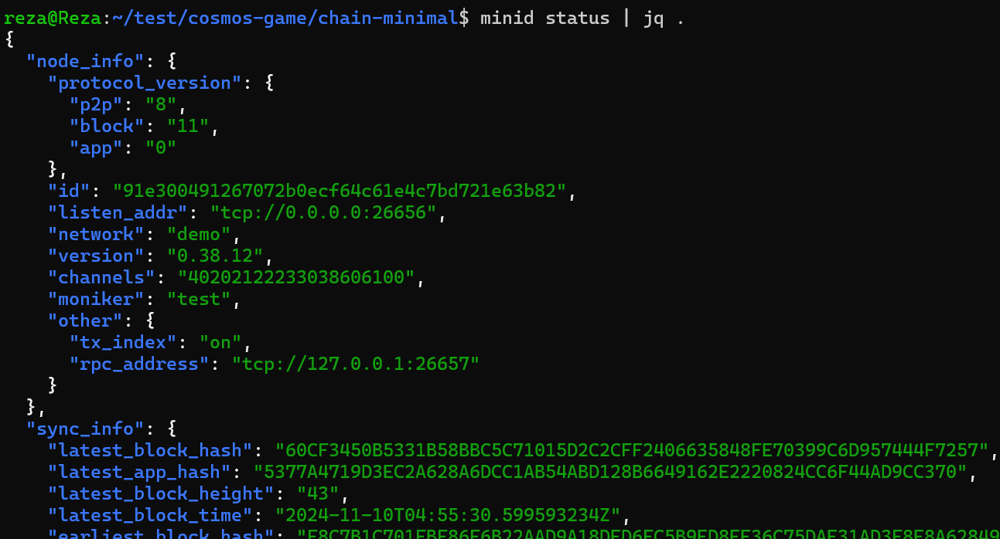
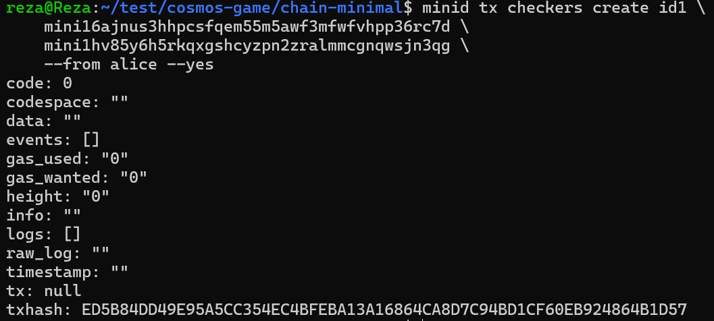
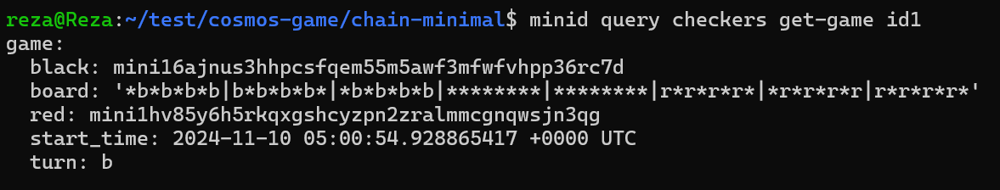
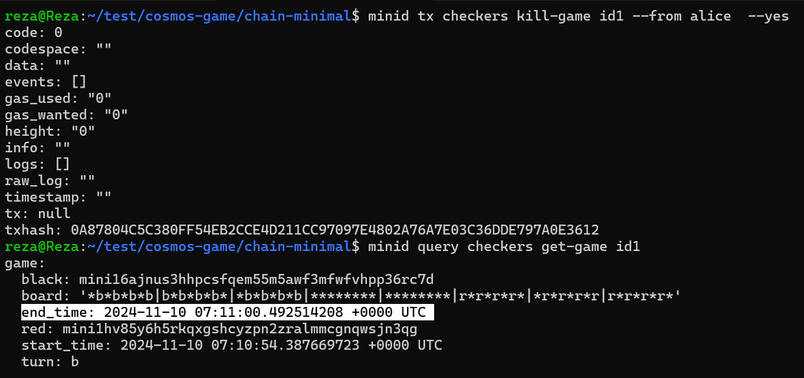

# Mini - A minimal Cosmos SDK chain

This repository contains an example of a tiny, but working Cosmos SDK chain.
It uses the least modules possible and is intended to be used as a starting point for building your own chain, without all the boilerplate that other tools generate. It is a simpler version of Cosmos SDK's [simapp](https://github.com/cosmos/cosmos-sdk/tree/main/simapp).

`Minid` uses the **latest** version of the [Cosmos-SDK](https://github.com/cosmos/cosmos-sdk).

## How to use

In addition to learn how to build a chain thanks to `minid`, you can as well directly run `minid`.

### Installation

Install and run `minid`:

```sh
git clone git@github.com:cosmosregistry/chain-minimal.git
cd chain-minimal
chmod +x ./scripts/init.sh # In case you need to make the script executable
make install # install the minid binary
make init # initialize the chain
minid start # start the chain
```

```sh
minid tx checkers --help
minid keys list --keyring-backend test
minid query checkers --help
```


----------------------

```shell
 minid status | jq .
 ```


---------------------------------------

```sh
minid tx checkers create id1 \
    mini16ajnus3hhpcsfqem55m5awf3mfwfvhpp36rc7d \
    mini1hv85y6h5rkqxgshcyzpn2zralmmcgnqwsjn3qg \
    --from alice --yes
```



---------------------------------------


```shell
reza@Reza:~/test/cosmos-game/chain-minimal$ minid query tx ED5B84DD49E95A5CC354EC4BFEBA13A16864CA8D7C94BD1CF60EB924864B1D57
code: 0
codespace: ""
data: 12260A242F616C6963652E636865636B6572732E76312E526573436865636B657273546F7272616D
events:
- attributes:
  - index: true
    key: fee
    value: ""
  - index: true
    key: fee_payer
    value: mini1c0h0cdgyh3xj3shzuxwyh6g40eryc7cvle2zrv
  type: tx
- attributes:
  - index: true
    key: acc_seq
    value: mini1c0h0cdgyh3xj3shzuxwyh6g40eryc7cvle2zrv/1
  type: tx
- attributes:
  - index: true
    key: signature
    value: YXBAMYGE0saKqKvJGZ5VCDsCk9Dn3V2xTRLPfKkX6coI86yYQpV9Fexisn3mdLg3PuBMkcWeN63+JBGWJLytKg==
  type: tx
- attributes:
  - index: true
    key: action
    value: /alice.checkers.v1.ReqCheckersTorram
  - index: true
    key: sender
    value: mini1c0h0cdgyh3xj3shzuxwyh6g40eryc7cvle2zrv
  - index: true
    key: module
    value: checkers
  - index: true
    key: msg_index
    value: "0"
  type: message
gas_used: "39137"
gas_wanted: "200000"
height: "136"
info: ""
logs: []
raw_log: ""
timestamp: "2024-11-10T05:00:54Z"
tx:
  '@type': /cosmos.tx.v1beta1.Tx
  auth_info:
    fee:
      amount: []
      gas_limit: "200000"
      granter: ""
      payer: ""
    signer_infos:
    - mode_info:
        single:
          mode: SIGN_MODE_DIRECT
      public_key:
        '@type': /cosmos.crypto.secp256k1.PubKey
        key: A62CUx+tV0lx/YmwINPUu4AkQr+UUbWHMPlCZ97LyvnG
      sequence: "1"
    tip: null
  body:
    extension_options: []
    memo: ""
    messages:
    - '@type': /alice.checkers.v1.ReqCheckersTorram
      black: mini16ajnus3hhpcsfqem55m5awf3mfwfvhpp36rc7d
      creator: mini1c0h0cdgyh3xj3shzuxwyh6g40eryc7cvle2zrv
      index: id1
      red: mini1hv85y6h5rkqxgshcyzpn2zralmmcgnqwsjn3qg
    non_critical_extension_options: []
    timeout_height: "0"
  signatures:
  - YXBAMYGE0saKqKvJGZ5VCDsCk9Dn3V2xTRLPfKkX6coI86yYQpV9Fexisn3mdLg3PuBMkcWeN63+JBGWJLytKg==

```
---------------------------------------
```shell
minid query checkers get-game id1
```



---------------------------------------

```shell
minid tx checkers kill-game id1 --from alice  --yes
```



---------------------------------------

```shell
minid export | jq '.app_state.checkers'

{
  "params": {},
  "indexed_stored_game_list": [
    {
      "index": "id1",
      "stored_game": {
        "board": "*b*b*b*b|b*b*b*b*|*b*b*b*b|********|********|r*r*r*r*|*r*r*r*r|r*r*r*r*",
        "turn": "b",
        "black": "mini16ajnus3hhpcsfqem55m5awf3mfwfvhpp36rc7d",
        "red": "mini1hv85y6h5rkqxgshcyzpn2zralmmcgnqwsjn3qg",
        "start_time": "2024-11-10 07:10:54.387669723 +0000 UTC",
        "end_time": "2024-11-10 07:11:00.492514208 +0000 UTC"
      }
    }
  ]
}
```

---------------------------------------


## Useful links

* [Cosmos-SDK Documentation](https://docs.cosmos.network/)
